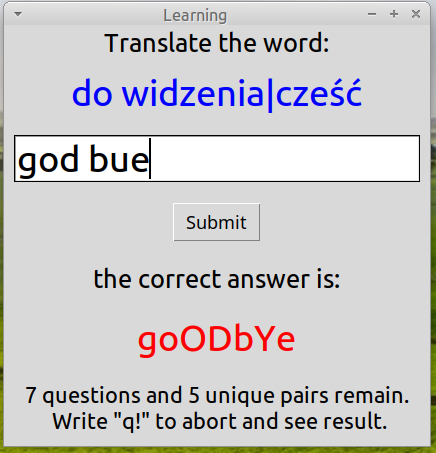
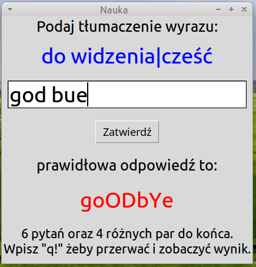

# Pytacz 3.0 (EN)

**Pytacz 3.0** helps you learn vocabulary.

The program asks you to translate words. Initially, each word pair starts with an occurrence count of 1. If you answer correctly, the occurrence count for that pair decreases by one, and you proceed to the next question. If you answer incorrectly, three things will happen:  
1. The corrected answer will be displayed, with capital letters highlighting the incorrect letters in your response.  
2. The occurrence count for that word pair will increase by two.  
3. The next question will repeat the same pair.  

You can see both the total number of questions left and the number of unique word pairs remaining. When all occurrence counts reach 0, your learning session is over – you've mastered the vocabulary!

At the end of the session, the word pairs you struggled with the most are saved in the `"najtrudniejsze"` folder.

---

## GUI

The program is available in both text-based and graphical versions.  

- In **text mode**, the current occurrence count for each question is displayed in a table at the top.  
- The **graphical version** is recommended, as it provides the option to read words aloud. 

## Demonstration video

You can watch a demonstration of how the program works. The video files are located in the `demo` folder. You can also watch the English demo [here](https://mega.nz/file/P51BkbKK#QeXFqUP9Gp2iOnp35FOTg4F8sIcvKGZINshEqhpfHic).

### Screenshots

Example screenshots of the graphical interface:

**English version:**  


**Polish version:**  


---

## Vocabulary

Each file in the `do_nauki` folder contains two columns of words. By default, these are Polish words and their English translations (separated by semicolons). Different variants of a word can be entered by separating them with a pipe `|`. You can modify or add files as needed. Comments can be added by starting a line with `#`.

---

## Required Packages

- Python 3  
- The following Python libraries (installable via pip):  
  - `unidecode`  
  - `Levenshtein`  
  - `pygame`  
  - `pyttsx3` (for text-to-speech conversion; required only for the GUI version, with no internet connection needed)  
  - `gTTS` (for text-to-speech conversion; required only for the GUI version)  

---

## Installation

### Windows:

1. Download all files.  
2. Install Python (e.g., from the Microsoft Store).  
3. Open Command Prompt (`Win + R → type cmd → Enter`) and run:  

   ```Command
   pip install unidecode Levenshtein pygame pyttsx3 gTTS
   ```

### Linux:

1. Download all files.  
2. Open the terminal and run:  

   ```bash
   sudo apt install -y python3
   pip install unidecode Levenshtein pygame pyttsx3 gTTS
   ```

### macOS:

1. Download all files.  
2. Install Python if it is not already installed (you can install it via Homebrew).  
3. Open the Terminal and run:  

   ```bash
   brew install python3
   pip3 install unidecode Levenshtein pygame pyttsx3 gTTS
   ```

---

## Running the Program

1. Open the terminal (or Command Prompt for Windows).  
   - On Windows: `Win + R → type cmd → Enter`  
2. Navigate to the Pytacz folder.  
   - On Windows: `cd "Downloads\pytacz4"` (assuming the files are in the `Downloads` folder)  
3. Run one of the following commands, depending on the desired mode:

   - **Text mode (Linux/macOS/Windows):**  
     ```bash
     python3 pytacz_text.py
     ```
     or  
     ```Command
     python pytacz_text.py
     ```

   - **Graphical mode:**  
     ```bash
     python3 pytacz_gui4.0.py
     ```
     or  
     ```Command
     python pytacz_gui4.0.py
     ```

If you're using a Python virtual environment on Linux or macOS (e.g., `myenv` in this case), you can run:

```bash
bash run_pytacz_gui4.0.sh
```

You can always modify `run_pytacz_gui4.0.sh` to match your environment name.

---

# Pytacz 3.0 (PL)  

**Pytacz 3.0** pomaga w nauce słownictwa.  

Program zadaje pytania o tłumaczenie słów. Na początku każda para słów ma liczbę wystąpień równą 1. Jeśli odpowiesz poprawnie, liczba wystąpień dla tej pary zmniejszy się o jeden, a następnie przejdziesz do kolejnego pytania. Jeśli odpowiesz błędnie, nastąpią trzy rzeczy:  
1. Zostanie wyświetlona poprawna odpowiedź, a błędne litery w Twojej odpowiedzi zostaną wyróżnione wielkimi literami.  
2. Liczba wystąpień dla tej pary wzrośnie o dwa.  
3. Kolejne pytanie będzie dotyczyć tej samej pary słów.  

Możesz zobaczyć zarówno całkowitą liczbę pytań, które pozostały, jak i liczbę unikalnych par słów. Gdy wszystkie liczby wystąpień osiągną 0, Twoja sesja nauki się zakończy – opanowałeś słownictwo!  

Na koniec sesji pary słów, które sprawiły Ci największą trudność, zostaną zapisane w folderze `"najtrudniejsze"`.  


---

## Interfejs graficzny  

Program jest dostępny w wersji tekstowej oraz graficznej.  

- W **trybie tekstowym** aktualna liczba wystąpień dla każdego pytania jest wyświetlana w tabeli na górze ekranu.  
- **Wersja graficzna** jest zalecana, ponieważ umożliwia odczytywanie słów na głos. 

## Nagranie demonstracyjne  

Możesz obejrzeć demonstrację działania programu. Pliki wideo znajdują się w folderze `demo`. Możesz również obejrzeć polskie demo [tutaj](https://mega.nz/file/C90wBSTa#skcDnw5jHAjXC4mK3yImJaZngIzHJ01-vX7L3ADx78I).  

### Zrzuty ekranu  

Przykładowe zrzuty ekranu interfejsu graficznego:  

**Wersja angielska:**  
  

**Wersja polska:**  
  

---

## Słownictwo  

Każdy plik w folderze `do_nauki` zawiera dwie kolumny słów. Domyślnie są to polskie słowa i ich angielskie tłumaczenia (oddzielone średnikami). Różne warianty słowa można wprowadzić, oddzielając je pionową kreską `|`. Możesz modyfikować lub dodawać pliki według potrzeb. Komentarze można dodawać, rozpoczynając linię od `#`.

---

## Wymagane pakiety  

- Python 3  
- Następujące biblioteki Pythona (można zainstalować za pomocą `pip`):  
  - `unidecode`  
  - `Levenshtein`  
  - `pygame`  
  - `pyttsx3` (do syntezatora mowy; wymagane tylko dla wersji graficznej, działa bez internetu)  
  - `gTTS` (do syntezatora mowy; wymagane tylko dla wersji graficznej)  

---

## Instalacja  

### Windows:  

1. Pobierz wszystkie pliki.  
2. Zainstaluj Pythona (np. ze sklepu Microsoft Store).  
3. Otwórz Wiersz polecenia (`Win + R → wpisz cmd → Enter`) i uruchom:  

   ```Command
   pip install unidecode Levenshtein pygame pyttsx3 gTTS
   ```

### Linux:  

1. Pobierz wszystkie pliki.  
2. Otwórz terminal i wpisz:  

   ```bash
   sudo apt install -y python3
   pip install unidecode Levenshtein pygame pyttsx3 gTTS
   ```

### macOS:  

1. Pobierz wszystkie pliki.  
2. Jeśli Python nie jest jeszcze zainstalowany, możesz go zainstalować przez Homebrew.  
3. Otwórz Terminal i wpisz:  

   ```bash
   brew install python3
   pip3 install unidecode Levenshtein pygame pyttsx3 gTTS
   ```

---

## Uruchamianie programu  

1. Otwórz terminal (lub Wiersz polecenia w Windows).  
   - W Windows: `Win + R → wpisz cmd → Enter`  
2. Przejdź do folderu Pytacz.  
   - W Windows: `cd "Downloads\pytacz4"` (zakładając, że pliki znajdują się w folderze `Downloads`)  
3. Uruchom jedną z poniższych komend, w zależności od wybranego trybu:

   - **Tryb tekstowy (Linux/macOS/Windows):**  
     ```bash
     python3 pytacz_text.py
     ```
     lub  
     ```Command
     python pytacz_text.py
     ```

   - **Tryb graficzny:**  
     ```bash
     python3 pytacz_gui4.0.py
     ```
     lub  
     ```Command
     python pytacz_gui4.0.py
     ```

Jeśli korzystasz z wirtualnego środowiska Pythona na Linuxie lub macOS (np. `myenv`), możesz uruchomić program poleceniem:

```bash
bash run_pytacz_gui4.0.sh
```

Możesz również zmodyfikować nazwę w pliku `run_pytacz_gui4.0.sh`, aby dopasować ją do swojej konfiguracji środowiska.  

